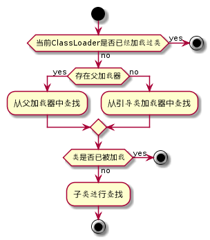
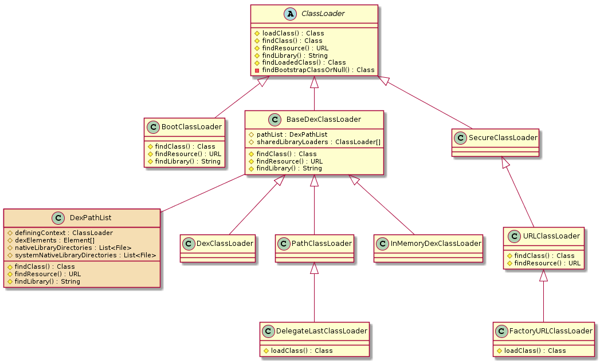

**阅读本文你能收获到**

* 了解 Java/Android中类加载器及其工作流程
* Android 开发过程中类加载器的应用场景

<h3 id="1">类加载器</h3>
类加载器是虚拟机运行时动态加载字节码文件的入口。注意这里的虚拟机并不特指 Java虚拟机 或 Android虚拟机。通常来说开发者写的代码经过“前端编译器”编译成字节码文件集（Java-jar, Android-dex等）之后交给虚拟机，而虚拟机加载这些字节码文件集就是通过类加载器完成。

应用程序包的字节码文件集是经过“前段编译器”精挑细选得到的，程序运行所需要的任意代码及资源都被打进程序包中。但实际上用户在使用程序时往往难以走遍程序所有逻辑，因此虚拟机只需按需加载当前用户场景所涉及到的代码。这便决定了类加载器的加载场景 “按需加载”。


应用程序包实际运行是依赖“运行环境”的。比如 Java 程序需要依赖 JRE 进行运行，而 Android 程序则依赖 Application Framework。当然这里讨论的仅仅是下面第一层，更下层的还有Kernel等不在讨论范围内。而这些环境运行时提供了运行程序库依赖的支持。如果应用程序包中使用了运行环境中的类，那运行时这部分类该如何加载？ 同时，应用程序内的类又是如何加载的呢？ 事实上，虚拟机对要加载的类进行“域”划分，不同“域”的加载委托给不同的类加载器进行加载，这种加载模式称为 “委托加载”。

<h4 id="1_3">委托加载 </h4>

除了系统提供的类加载，开发者也可以自定义 ClassLoader，在整个应用程序加载流程中所有的类加载器有着严格的加载逻辑, 按照 ”按需加载，委托加载“ 的思想组合起来一起完成整个程序的类加载，这种加载模型称为 ”双亲委派模型“。在了解 Java 和 Android 平台的类加载器之前，我们先看下委托加载的流程。因为整个 “委托加载” 的思想都体现在 [Java.lang.ClassLoader](https://android.googlesource.com/platform/libcore/+/refs/heads/master/ojluni/src/main/java/java/lang/ClassLoader.java), 两个平台的加载流程方向上是一致的。

`ClassLoader` 是一个抽象类, 没有抽象方法, 加载流程统一集中在 [ClassLoader#loadClass](https://android.googlesource.com/platform/libcore/+/refs/heads/master/ojluni/src/main/java/java/lang/ClassLoader.java#359).

```
    protected Class<?> loadClass(String name, boolean resolve)
        throws ClassNotFoundException
    {
            // 1
            Class<?> c = findLoadedClass(name);
            if (c == null) {
                try {
                    if (parent != null) {
                    	// 2
                        c = parent.loadClass(name, false);
                    } else {
                    	// 3
                        c = findBootstrapClassOrNull(name);
                    }
                } catch (ClassNotFoundException e) {
                }
                if (c == null) {
                    // 4
                    c = findClass(name);
                }
            }
            return c;
    }
```
* `1处` 通过 native （VMClassLoader实现）手段检测当前 ClassLoader 是否已经加载过该类， 如果加载过则直接返回。
* `2处` 当且仅当 ClassLoader 没有加载过类且父加载器存在时, 尝试调用 *parent#loadClass* 获取
* `3处` 当且仅当 ClassLoader 没有加载过类且父加载器不存在是, 尝试通过 native 手段从引导类加载器获取
* 如果上述途径都没有获取到, 则 findClass 获取, 默认方法内抛出异常, 子类需要实现覆盖实现自己的逻辑。

活动图如下 



值得注意的是, *loadClass* 一个 **protected** 权限级别的方法, 这意味着 ”双亲委派模型“ 并不是唯一的加载模式而是系统建议我们使用的模式。

再来看看 Java 和 Android 平台提供哪些类加载器, 以 Android 加载器的内容重点展开。

<h4 id="1_1">Java 流派</h4>

Java系统主要提供了 3 种类加载器

1. `Bootstrap Classloader `，启动类加载器，负责加载 \lib 目录下或者被 -Xbootclasspath参数所指定的路径种的，能被虚拟机识别的类库 （即所有 java.* 开头的类）。
2. `Extension Classloader `，扩展类加载器，负责加载 \lib\ext 目录下或者被 java.ext.dirs 系统变量指定路径的类库（例如所有 javax.* 开头的类和存放在 JRE 的 ext 目录下的类）。
3. `Application Classloader `，应用程序类加载器，负责加载用户类路径指定的类库，开发者可以直接使用这个类加载器（即我们自己写的 Java程序时新创建的类都是通过它来接在的）。


<h4 id="1_2">Android 流派</h4>

Android系统也提供了多种类加载器, 这些类加载器都由 `java.lang.ClassLoader` 继承而来。

> ps: 本文所涉及到的源码均以 Andriod P 版本作为展开分析

以 Android 类加载为例子，这里画了类图方便直观预览。



上述类图除了橙色的 `DexPathList` 类之外, 其他都都是 Android 提供的类加载器。按照 Java 系统类加载器的划分, Android 类加载器大致也可以划分 3 种类加载器。

1. 加载 Framework 层类,  `BootClassLoader` 为该类型类加载器, 在 Android 系统启动的时候创建该实例, 当应用程序系统也需要用到 Framework 类是会传递该类加载器实例给应用层。
2. 加载已经安装的 apk 中的类, `PathClassLoader` 为该类型类加载器。
3. 加载jar/apk/dex,未安装过的 apk 中的类, `DexClassLoader` 或 `PathClassLoader` 为该类型类加载器。


<h4 id="1_2"> BaseDexClassLoader </h4>
Android 应用层的类加载逻辑基本都围绕 `BaseDexClassLoader` 及相关子类开展的, 也是平时应用层开发热修复, 插件化技术实现中重要的技术基础。下面重点分析这部分内容, 在掌握这部分知识之前, 希望我们能达成一致的共识 “带着问题在源码中找答案”。

待解决的问题 ：

* 为什么要设计 BaseDexClassLoader? 
* BaseDexClassLoader的子类用来解决什么问题 ?
* 针对 BaseDexClassLoader 及延伸的子类, 我们可以实际开发中可以用来做什么 ？ 

> 为什么要设计 BaseDexClassLoader ?

由于移动端架构及性能原因, Android 针对 class 文件进一步优化形成 dex 文件。 为了适配加载 dex 文件, `BaseDexClassLoader ` 应运而生。 在[BaseDexClassLoader.DexPathList](https://android.googlesource.com/platform/libcore/+/refs/heads/master/dalvik/src/main/java/dalvik/system/BaseDexClassLoader.java#51) 源码中可知, `BaseDexClassLoader` 持有 `DexPathList` 对象且该对象托管了其查找 Class, Resource 及 Library的功能。


>  BaseDexClassLoader的子类用来解决什么问题 ?

BaseDexClassLoader的众多子类并没有覆盖其任何方法, 唯一不同的地方在于每个子类的构造器参数。 

```
//from BaseDexClassLoader.java
 public BaseDexClassLoader(String dexPath, File optimizedDirectory,
            String librarySearchPath, ClassLoader parent) {
        super(parent);
        this.pathList = new DexPathList(this, dexPath, librarySearchPath, optimizedDirectory);
 }
 
 public BaseDexClassLoader(ByteBuffer[] dexFiles, String librarySearchPath, ClassLoader parent) {
        super(parent);
        this.pathList = new DexPathList(this, dexFiles, librarySearchPath);
        this.sharedLibraryLoaders = null;
 }
```
参数的差异化体体现在构建 DexPathList 对象上, 从 [DexPathList](https://android.googlesource.com/platform/libcore/+/refs/heads/master/dalvik/src/main/java/dalvik/system/DexPathList.java) 切入。

```
//from DexPathList.java.java

    public DexPathList(ClassLoader definingContext, String dexPath,
            String librarySearchPath, File optimizedDirectory) {
        this(definingContext, dexPath, librarySearchPath, optimizedDirectory, false);
    }

    public DexPathList(ClassLoader definingContext, ByteBuffer[] dexFiles,
            String librarySearchPath) {
		//...判空删减
        this.definingContext = definingContext;
        this.nativeLibraryDirectories = splitPaths(librarySearchPath, false);
        this.systemNativeLibraryDirectories =
                splitPaths(System.getProperty("java.library.path"), true);
        this.nativeLibraryPathElements = makePathElements(getAllNativeLibraryDirectories());
  
        this.dexElements = makeInMemoryDexElements(dexFiles, suppressedExceptions);
        
         ArrayList<IOException> suppressedExceptions = new ArrayList<IOException>();
        if (suppressedExceptions.size() > 0) {
            this.dexElementsSuppressedExceptions =
                    suppressedExceptions.toArray(new IOException[suppressedExceptions.size()]);
        } else {
            dexElementsSuppressedExceptions = null;
        }
    }
    
    DexPathList(ClassLoader definingContext, String dexPath,
            String librarySearchPath, File optimizedDirectory, boolean isTrusted) {
            
		//...判空删减
        this.definingContext = definingContext;
        this.nativeLibraryDirectories = splitPaths(librarySearchPath, false);
        this.systemNativeLibraryDirectories =
                splitPaths(System.getProperty("java.library.path"), true);
        this.nativeLibraryPathElements = makePathElements(getAllNativeLibraryDirectories());
        
        this.dexElements = makeDexElements(splitDexPath(dexPath), optimizedDirectory,
                                           suppressedExceptions, definingContext, isTrusted);
        ArrayList<IOException> suppressedExceptions = new ArrayList<IOException>();
        if (suppressedExceptions.size() > 0) {
            this.dexElementsSuppressedExceptions =
                suppressedExceptions.toArray(new IOException[suppressedExceptions.size()]);
        } else {
            dexElementsSuppressedExceptions = null;
        }
    }   
```
上述代码做了删减, 所有参数都不能为 null。 第 2 和 3 构造器做了代码顺序调整方便看出差异 
“ 在构建 this.dexElements 的时候前者使用 makeInMemoryDexElements 后者使用 makeDexElements。”

```
//from DexPathList.java.java

	//直接读取 dexFiles 内容并转化为 DexFile 数组
    private static Element[] makeInMemoryDexElements(ByteBuffer[] dexFiles,
            List<IOException> suppressedExceptions) {
        Element[] elements = new Element[dexFiles.length];
        int elementPos = 0;
        for (ByteBuffer buf : dexFiles) {
            try {
                DexFile dex = new DexFile(buf);
                elements[elementPos++] = new Element(dex);
            } catch (IOException suppressed) {
                System.logE("Unable to load dex file: " + buf, suppressed);
                suppressedExceptions.add(suppressed);
            }
        }
        if (elementPos != elements.length) {
            elements = Arrays.copyOf(elements, elementPos);
        }
        return elements;
    }
    
    //直接读取 files 内容并转化为 DexFile 数组
    private static Element[] makeDexElements(List<File> files, File optimizedDirectory,
            List<IOException> suppressedExceptions, ClassLoader loader, boolean isTrusted) {
      Element[] elements = new Element[files.size()];
      int elementsPos = 0;
      for (File file : files) {
          if (file.isDirectory()) {
              elements[elementsPos++] = new Element(file);
          } else if (file.isFile()) {
              String name = file.getName();
              DexFile dex = null;
              
              //.dex结尾
              if (name.endsWith(DEX_SUFFIX)) {
              
         			//原始dex文件
    				 dex = loadDexFile(file, optimizedDirectory, loader, elements);
                  if (dex != null) {
                       elements[elementsPos++] = new Element(dex, null);
                  }
              } else {
              
                  dex = loadDexFile(file, optimizedDirectory, loader, elements);
                  if (dex == null) {
                      elements[elementsPos++] = new Element(file);
                  } else {
                      elements[elementsPos++] = new Element(dex, file);
                  }
              }
              
              //isTrusted 为 false
              if (dex != null && isTrusted) {
                dex.setTrusted();
              }
          } else {
              System.logW("ClassLoader referenced unknown path: " + file);
          }
      }
      if (elementsPos != elements.length) {
          elements = Arrays.copyOf(elements, elementsPos);
      }
      return elements;
    } 
    
    private static DexFile loadDexFile(File file, File optimizedDirectory, ClassLoader loader,
                                       Element[] elements)
            throws IOException {
        if (optimizedDirectory == null) {
            return new DexFile(file, loader, elements);
        } else {
            //如果文件不是以.dex结尾的，则需要进行转化
            String optimizedPath = optimizedPathFor(file, optimizedDirectory);
            return DexFile.loadDex(file.getPath(), optimizedPath, 0, loader, elements);
        }
    }
```
代码有点长, 不过逻辑比较清晰。

* `makeInMemoryDexElements` 是使用内存中已有的 buffer 数组来创建 DexFile 数组
* `makeDexElements` 需要读取 files 数组, 如果文件是以 `.dex` 结尾则默认是一个 dex 文件, 直接构建 DexFile 对象。如果不是则需要走 `loadDexFile` 方法创建 DexFile 对象。 当存在 optimizedDirectory 文件时则从该文件中读取加载并生成 DexFile 对象。

现在再来看 BaseDexClassLoader 子类的构造器。

```
 //from PathClassLoader.java
  public PathClassLoader(String dexPath, ClassLoader parent) {
        super(dexPath, null, null, parent);
  }
  public PathClassLoader(String dexPath, String librarySearchPath, ClassLoader parent) {
        super(dexPath, null, librarySearchPath, parent);
  }
  
  //from DexClassLoader.java
  public DexClassLoader(String dexPath, String optimizedDirectory,
            String librarySearchPath, ClassLoader parent) {
        super(dexPath, null, librarySearchPath, parent);
  }
  
  //from InMemoryDexClassLoader
  public InMemoryDexClassLoader(@NonNull ByteBuffer @NonNull [] dexBuffers,
            @Nullable String librarySearchPath, @Nullable ClassLoader parent) {
        super(dexBuffers, librarySearchPath, parent);
  }
  public InMemoryDexClassLoader(@NonNull ByteBuffer @NonNull [] dexBuffers,
            @Nullable ClassLoader parent) {
        this(dexBuffers, null, parent);
  }
  public InMemoryDexClassLoader(@NonNull ByteBuffer dexBuffer, @Nullable ClassLoader parent) {
        this(new ByteBuffer[] { dexBuffer }, parent);
  }

```
卧槽, `DexClassLoader` 和 `PathClassLoader` 存在一样的构造器啊。翻开 BaseDexClassLoader 文档一开

```
optimizedDirectory	File: this parameter is deprecated and has no effect since API level 26.
```
也就是说 **optimizedDirectory** 在 8.0 之后就已经失效了, 8.0 以前照常使用。再翻看 PathClassLoader 和 DexClassLoader 文档一看 

```
//from PathClassLoader.java
* Provides a simple {@link ClassLoader} implementation that operates on a list
* of files and directories in the local file system, but does not attempt to
* load classes from the network. Android uses this class for its system class
* loader and for its application class loader(s).

//from DexClassLoader.java 
* A class loader that loads classes from {@code .jar} and {@code .apk} files
* containing a {@code classes.dex} entry. This can be used to execute code not
* installed as part of an application
* Prior to API level 26, this class loader requires an
* application-private, writable directory to cache optimized classes.
* Use {@code Context.getCodeCacheDir()} to create such a directory:
* <pre>   {@code
*   File dexOutputDir = context.getCodeCacheDir();
* }</pre>
*
* <p><strong>Do not cache optimized classes on external storage.</strong>
* External storage does not provide access controls necessary to protect your
* application from code injection attacks
```

也就是说, 8.0 以前 DexClassLoader可以随便从外部存储加载 dex 相关的文件, 8.0 及以后不再支持从外部存储加载这类内容, 因为无法保证加载的内容是不会对应用造成攻击。 

当我们安装完 apk 之后, apk 文件会存放在 /data/app 目录下， 而从 apk 中解压得到的 dex 会存放到 /data/dalvik-cache 中。
app 启动之后, 构建 ClassLoader 流程如下

1. ActivityThread#handleBindApplication
2. ContextImpl#getClassLoader
3. LoadedApk#makePaths(计算dexPath) -> LoadedApk#getClassLoader 
4. ApplicationLoaders#getClassLoader
5. PathClassLoaderFactory#createClassLoader
6. PathClassLoader#构造器

所以实际上如果我们获取项目已经初始化过的 `PathClassLoader` 对象, 实际上该对象是用于加载已经安装过的 apk 的dex。
那么既然 8.0 之后 `PathClassLoader` 和 `DexClassLoader` 的构造器大致相同, 那我们是否都用于加载外部 dex 文件呢 ？
答案是肯定的, 测试代码比较简单不做展示, 流程是： "通过先 build 一个 apk 之后在主线程中 new PathClassLoader 和 DexClassLoader 并尝试加载 apk 中的类" 。
这样看来, 8.0b 版本以上的 `PathClassLoader` 和 `DexClassLoader` 的功能大致相同 。 而 `InMemoryDexClassLoader` 则是从指定的缓存内容中读取类信息。 

在 api 27 （Android 8.1） 中新增 `DelegateLastClassLoader`， 该类继承 `PathClassLoader` 。在 [委托加载](#1_3) 章节中最后提到, “双亲委派模型”的加载并不是唯一的方式, 而 `DelegateLastClassLoader` 就是最好的证明。 

```
//from DelagateLastClassLoader.java

   @Override
    protected Class<?> loadClass(String name, boolean resolve) throws ClassNotFoundException {
     		
        // 1		
        Class<?> cl = findLoadedClass(name);
        if (cl != null) {
            return cl;
        }
        
        // 2
        try {
            return Object.class.getClassLoader().loadClass(name);
        } catch (ClassNotFoundException ignored) {
        }
        
        // 3
        ClassNotFoundException fromSuper = null;
        try {
            return findClass(name);
        } catch (ClassNotFoundException ex) {
            fromSuper = ex;
        }
        
        // 4
        try {
            return getParent().loadClass(name);
        } catch (ClassNotFoundException cnfe) {
            throw fromSuper;
        }
    }
```

* `1处` 通过 native （VMClassLoader实现）手段检测当前 ClassLoader 是否已经加载过该类， 如果加载过则直接返回。
* `2处` 尝试通过 native 手段从引导类加载器获取
* `3处` 则 findClass 获取, 默认方法内抛出异常, 子类需要实现覆盖实现自己的逻辑
* `4处` 则尝试调用 *parent#loadClass* 获取


> 针对 BaseDexClassLoader 及延伸的子类, 我们可以实际开发中可以用来做什么 ?


