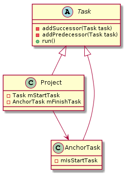
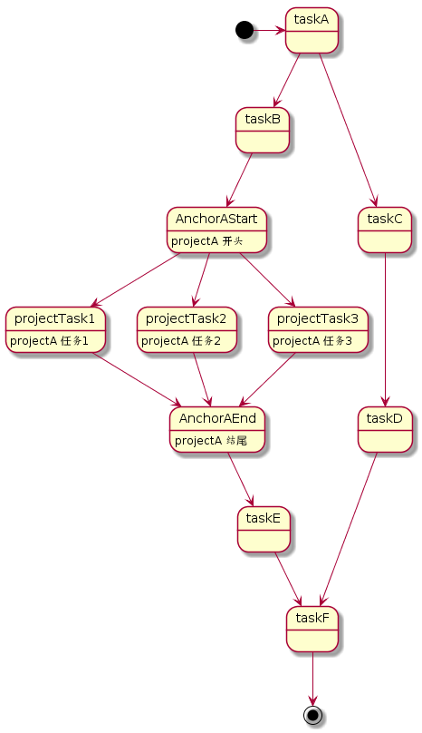

**阅读本文你能收获到**

* alpha 如何解决异步依赖的初始化
* 如何满足同异步初始化依赖并阻塞 Application 的场景

> 前段时间在做项目初始化整理发现Application#onCreate 内的初始化任务已经“乱七八糟”。有时候要添加和修改一个依赖时很是头疼，所以在整理代码的同时也在 Github 上看到 alpha 异步启动框架。所以当前晚上就 clone 下源码研究一番， 但最后还是有点点失落。。。


### alpha 如何解决异步依赖的初始化

**Alpha** 的定位是基于 PERT 图构建的 Android 异步启动框架，用于启动时并发完成依赖初始化。封装了 `Task` 类用于表示一个异步任务, 衍生出`Project` 及 `AnchorTask` 用于处理多个 *task* 对象构成的图结构。 其类图关系如下：



其外层业务只需要继承 `Task` 或者同个构建 `Project` 来编写业务依赖逻辑, 并通过设置 *successor* 和 *predecessor* 构建依赖图， 理想的结构应该如下:



但是如果你添加 Task 启动的时候，会收到 `xxxTask cannot be cast to com.alibaba.android.alpha.Project`。 从源码层上看确实不能从一个 *task* 启动。

```
//声明存放任务的容器
private SparseArray<Task> mProjectArray = new SparseArray<Task>();

//提供了添加的方法
public void addProject(Task project, String processName) {
    if (AlphaUtils.isMatchProcess(mContext, processName)) {
        mProjectForCurrentProcess = project;
    }
}

//启动的时候判断
public void start() {
    Project project = null;

    do {
    	 //...略去获取逻辑
	    project = (Project) task;
    } while (false);
    
    project.start();
}
```
从 `API` 设计上看, 如果暴露 *addProject* 方法添加  *task* 对象的话, 应该能从 *task* 对象启动才对。如果强制从 *project* 启动, 那么 *addProject* 方法就应该限制 `Project` 类型。

有了任务图之后, 在看看如何异步启动.

```
public synchronized void start() {
    if (mCurrentState != STATE_IDLE) {
        throw new RuntimeException("You try to run task " + mName + " twice, is there a circular dependency?");
    }

    switchState(STATE_WAIT);

	 //内部保留一个 runnable对象，存放真正的业务逻辑
    if (mInternalRunnable == null) {
        mInternalRunnable = new Runnable() {
            @Override
            public void run() {
                android.os.Process.setThreadPriority(mThreadPriority);
                long startTime = System.currentTimeMillis();

                switchState(STATE_RUNNING);
                Task.this.run();
                switchState(STATE_FINISHED);

                long finishTime = System.currentTimeMillis();
                recordTime((finishTime - startTime));

                notifyFinished();
                recycle();
            }
        };
    }

    //如果是在UI进程，则通过 Handler post出去
    if (mIsInUiThread) {
        sHandler.post(mInternalRunnable);
    } else {
     	 //线程池
        sExecutor.execute(mInternalRunnable);
    }
}

/*package*/ void notifyFinished() {
    if (!mSuccessorList.isEmpty()) {
        AlphaUtils.sort(mSuccessorList);
        
        //完成任务之后，通知后置任务 “我完成了，你们要准备开始啦”
        for (Task task : mSuccessorList) {
            task.onPredecessorFinished(this);
        }
    }

    if (!mTaskFinishListeners.isEmpty()) {
        for (OnTaskFinishListener listener : mTaskFinishListeners) {
            listener.onTaskFinish(mName);
        }

        mTaskFinishListeners.clear();
    }
}

synchronized void onPredecessorFinished(Task beforeTask) {

    if (mPredecessorSet.isEmpty()) {
        return;
    }
    mPredecessorSet.remove(beforeTask);
    //如果依赖的任务全部已经完成，则启动
    if (mPredecessorSet.isEmpty()) {
        this.blockInvokeThread = beforeTask.blockInvokeThread;
        start();
    }
}
```
代码逻辑比较清晰。**任务被执行时判断是否是主线程执行，如果是则通过 handler#post 发送出去排队处理, 否则交给线程池处理。任务处理完成之后通知依赖该任务的任务, 此时依赖该任务的任务的所有依赖都已经完成，则该任务启动执行。**

### 如何满足同异步初始化依赖并阻塞 Application 的场景

在探讨 ”如何满足同异步初始化依赖并阻塞 Application 的场景“ 之前，我们来举个例子。
假设存在以下依赖图

```
D（异）-> C（异） ->B （同步）->A（异）
或者
D（异）-> C（异） ->B （同步）->A（同）
```

在 Application#onCreate 中某个时刻执行依赖图

```
public void onCreate(){
  runTask（）	 
  code	       //代码段执行时刻 tCode
}
```
给定上述任务执行时间关系如下

```
//txStart 表示任务x的开始时刻
//txEnd 表示任务x的结束时刻
taStart < taEnd < tbStart < tbEnd < tcStart < tcEnd < tdStart < tdEnd
```

在 `Alpha` 中恒满足： *tCode* < *txStart* (x = {a,b,c,d}) 。也就是说, 如果存在代码段 *code* ,则框架无法满足这种场景。尽管  `Alpha` 中提供 *AlphaManager#waitUntilFinish* 用于阻塞执行线程，但是存在很大的缺陷 :

1. 假如在UI线程等待，则会造成死锁。其原因在于当前执行代码处等待解锁，而只有等到所有在主线程执行的 *task* 执行完才可能解锁，而 *task* 被 post 到消息队列里面，只有当解锁之后才能执行到消息队列的 *task* 。
2. 异步线程等待场景基本不需要，因为构建依赖图就是为了解决同异步执行问题，等待意味着存在依赖关系，可以通过构建正确的依赖图解决。

假如存在一种方案不仅能提供同异步执行能力，还能满足： *tCode* > *txEnd* (x = {a,b,c,d}),则能够解决上述场景。而且很多应用程序实际上都需要解决这个问题, 经过学习 `Alpha` 的设计及项目实践, 最终给出了这种方案。 `Anchors` 框架就此而生, 细节可查看 [开源框架 之 Anchors](http://yummylau.com/2019/03/18/%E5%BC%80%E6%BA%90%E6%A1%86%E6%9E%B6%E4%B9%8B%20Anchors/)


