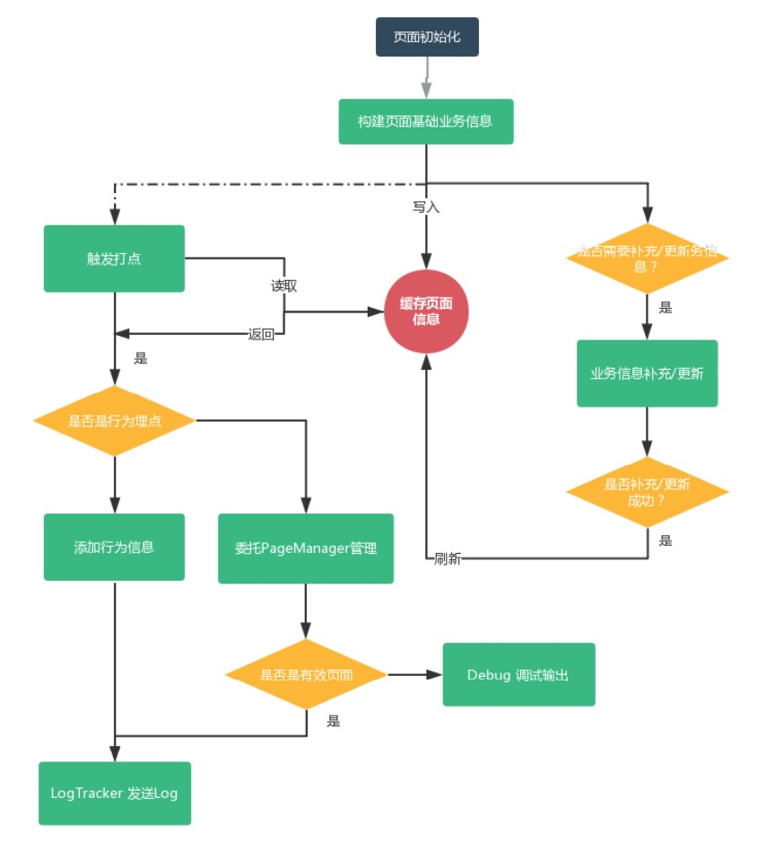
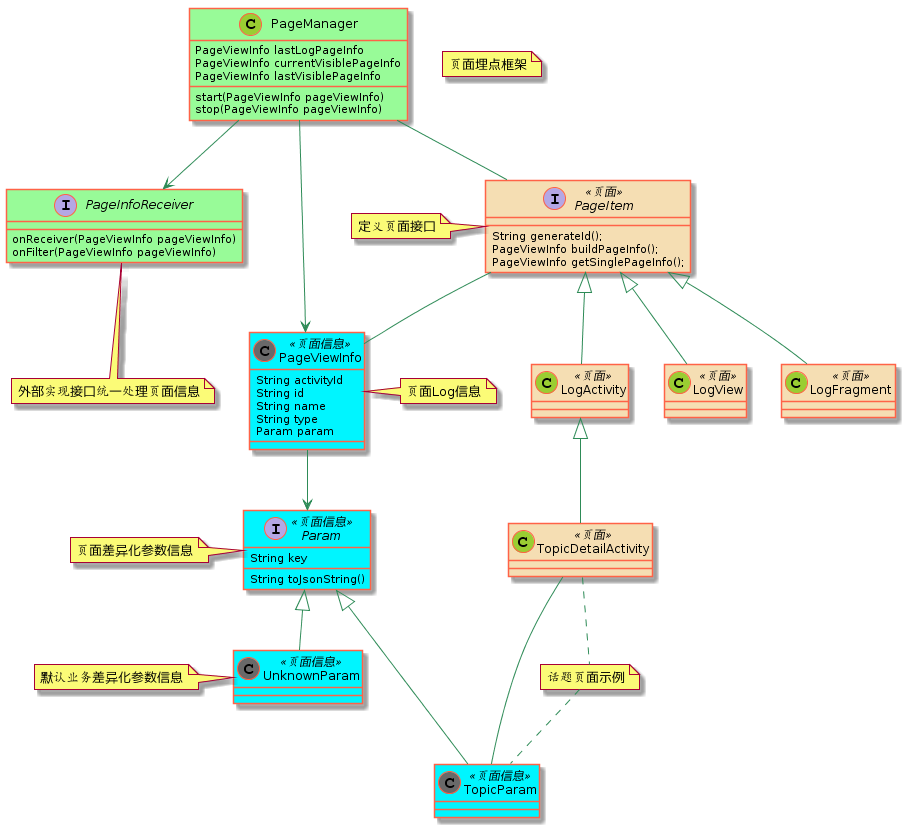

<!--more-->

### 背景

随着业务不断迭代更新，网易大神的页面结构变得越发复杂。在使用自助打点框架之前，我们用过百度统计/哈勃统计等第三方统计工具，但是对于“页面嵌套统计”存在缺陷。由于策划非常重视“页面嵌套的子页面”停留市场，故废弃第三方并建立一套支持“页面嵌套”统计的打点框架。
> 何为 “页面嵌套” ？ 并非指 Android 开发中的 fragment 页面，而是作为用户所能看见界面布局中被划分为 N 个子页面结构，子页面结构依然可以继续划分 M 个子页面结构....


好吧，一开始我真的无 Fuck 话说, 你是什么运营需求需要搞这么花里胡哨的。 不过第三方统计的确能统计到页面 Fragment 内潜的生命周期，但是对于 View 级的处理很不友好。而 Android 的视图层级结构恰好满足这个需求的页面原型结构，故下手开整。

### 设计

#### 保证原业务逻辑兼容
业务的迁移及扩展的第一要素是 "保证原业务逻辑不能收到影响" 。由于app中的业务逻辑信息通过 json 格式上传到服务器，所以先把页面中所涉及的页面信息通过涉及 Param 接口用于返回特定页面业务信息。

```
public class Param {
    public transient String key;
    public Param(String key) {
        this.key = key;
    }
    public String toJsonString() {
        return GsonUtils.getJsonString(this);
    }
}
```
其中 key 用于表示一块 “逻辑页面”，可能是view/fragment/activity。

#### Hook原业务页面的底层视图
要想在不同的逻辑页面底层统一监听声明周期并实现特定时刻的业务行为打点，最快速的方法是在基础类之前封装一层 Log 逻辑，由于我们基础类都存放在 `libbase` 模块，相对来说很是方便。

对于业务打点信息可分为两部分：“页面信息” + “业务信息” 

* 页面信息指的是逻辑页面的名称，类型，id，归属parentId，显示时间，隐藏时间；
* 业务信息指的是比如在逻辑页面点击一个登陆按钮，此时的登陆打点信息（登陆按钮id，登陆行为id，行为时间等）为业务信息。

> 事实上，上传到服务端信息不仅仅包含这些，还包含app信息/设备信息，这里不对这部分信息作扩展。

定义打点信息结构

```
public class PageViewInfo {
    public String activityId;   //  归属于哪个activity
    public String id;           //  页面hashCode
    public String name;         //  一般以页面的类名命名
    public String type;         //  页面类型，view/fragment/activity
    public Param param;         //  页面信息
    public PageViewInfo parent;//  父亲id,目前支持的是获取上一个activity中最小的page模块
    public boolean fromCopyActivity;    //是否是负责activity参数，由于fragment里面点击事件需要用到param信息，但是希望不要重复上报
    public long startTime = Long.MAX_VALUE;
    public long endTime = Long.MAX_VALUE;
    public PageViewInfo(@NonNull Param param) {
        this.param = param;
    }
}
```  
定义抽象页面打点信息接口

```
public interface PageItem {
    String generateId();
    PageViewInfo buildPageInfo();
	//为单例返回用于某些业务场景延迟初始化业务打点信息
    PageViewInfo getSinglePageInfo();
}
```

那么可以轻松实现针对 Activity 级的统计。

```
public class LogActivity extends AppCompatActivity implements PageItem {

    public PageViewInfo pageViewInfo;

    @Override
    protected void onResume() {
        super.onResume();
        PageManager.start(getSinglePageInfo());
    }

    @Override
    protected void onPause() {
        super.onPause();
        PageManager.stop(getSinglePageInfo());
    }

    @Override
    protected void onDestroy() {
        super.onDestroy();
        PageManager.destroy(generateId());
    }

    @Override
    public PageViewInfo buildPageInfo() {
        return PageUtils.getDefaultPageInfo();
    }

    @Override
    public PageViewInfo getSinglePageInfo() {
        if (pageViewInfo == null) {
            pageViewInfo = buildPageInfo();
            pageViewInfo.name = PageUtils.getName(this);
            pageViewInfo.activityId = PageUtils.getActivityId(this);
            pageViewInfo.id = generateId();
            pageViewInfo.type = "ACTIVITY";
        }
        return pageViewInfo;
    }

    /**
     * 继承 activity 的param和parent属性
     *
     * @param logFragment
     * @return
     */
    public PageViewInfo copyActivityPageInfo(LogFragment logFragment) {
        if (logFragment == null) {
            return PageUtils.getDefaultPageInfo();
        }
        PageViewInfo fragmentPageInfo = PageUtils.getDefaultPageInfo();
        fragmentPageInfo.name = PageUtils.getName(logFragment);
        fragmentPageInfo.activityId = PageUtils.getActivityId(logFragment);
        fragmentPageInfo.id = generateId();
        fragmentPageInfo.type = "FRAGMENT";
        PageViewInfo activityPageInfo = getSinglePageInfo();
        fragmentPageInfo.param = activityPageInfo.param;
        fragmentPageInfo.parent = activityPageInfo.parent;
        fragmentPageInfo.fromCopyActivity = true;
        return fragmentPageInfo;
    }

    @Override
    public String generateId() {
        return PageUtils.getId(this);
    }
}
```
其他的逻辑视图实现也基本一样。这里就不贴代码了。上述代码有几个需要点出

* `buildPageInfo` 为构建页面的打点信息，子类实现，提供默认实现
* `generateId` 一般为页面生成唯一id，用 hashcode就够了
* `getSinglePageInfo` 为该页面提供一个打点信息单例。比如我要统计 WebActivity 中该网页的 title 是什么，只有当 WebVied#load 完之后获取到 title 信息，然后才能通过 getSinglePageInfo 方法获取单粒设置 title 。
* `copyActivityPageInfo` 是用于特殊场景处理的预留方法。有一些业务公用的 Fragment 出现在不同的 Activity 容器中，策划可能根据不同场景来决定这个 Fragment 是不是一个逻辑视图 （=。=）。
* `onResume/onPause` PageManager 提供了初始化页面信息及上传一次页面信息的入口。 由于我们采用透明主题，所有选择在 `onPause` 的回调中出上传。

#### 打点信息的上传及管理

我们从基础类中统一处理了页面信息看似已经完美，实际上还存在一些棘手的问题。

* 页面的 parent 归属

	针对 fragment 的归属可以通过 fragmentManager/context 联合判断嵌套。但是针对 view 的归属就比较麻烦，context 仅仅只能反应该 view 存在的 activity 视图，并不代表是其父亲容器。所以在构建 view 的时候默 parent 视图为 activity，fragment 场景业务设置。

* 页面的链式设计

	这里的链式仅仅针对 activity 而言。同一个 activity 内的所有逻辑视图 activityId 都相同。而链式设计意味着需要记录当前 activity 上最后一个逻辑视图及最后一个 activity 上的最后一个逻辑视图。这里涉及到逻辑视图的进栈和出栈问题。由于页面加载的时候，页面层级越低越显初始化，而从上一个页面返回的时候，页面层级越高就越显初始化。
	
上代码

```
import android.support.annotation.Nullable;
import android.text.TextUtils;
import java.util.HashMap;
import java.util.Map;
import im.yixin.gl.log.page.PageConstants;
import im.yixin.gl.log.page.view.LogFragment;

public class PageManager {

    public static final Map<String, PageViewInfo> sCache = new HashMap();
    public static final Map<String, Long> sInfoTime = new HashMap<>();
    public static PageInfoReceiver sPageInfoReceiver;


    public static PageViewInfo lastLogPageInfo = null;             // 最后一个曝光page
    public static PageViewInfo currentVisiblePageInfo = null;      // 当前可见的page
    public static PageViewInfo lastVisiblePageInfo = null;         // 倒数第二个可见的page

    @Nullable
    public static PageViewInfo getInfo(String id) {
        if (!TextUtils.isEmpty(id)) {
            return sCache.get(id);
        }
        return null;
    }

    //初始化页面信息
    public static void start(PageViewInfo pageViewInfo) {
        if (!TextUtils.isEmpty(pageViewInfo.id)) {
            sInfoTime.put(pageViewInfo.id, System.currentTimeMillis());
            sCache.put(pageViewInfo.id, pageViewInfo);
            cacheLastVisiblePageInfo(pageViewInfo);
        }
    }


    public static void addPageInfo(LogFragment fragment) {
        if (fragment == null) {
            return;
        }
        stop(fragment.getSinglePageInfo());
    }

    //上传一次页面信息
    public static void stop(PageViewInfo pageViewInfo) {
        if (pageViewInfo != null && !TextUtils.isEmpty(pageViewInfo.id) && pageViewInfo.param != null) {
            PageViewInfo cacheInfo = sCache.get(pageViewInfo.id);
            if (cacheInfo == null) {
                sCache.put(pageViewInfo.id, pageViewInfo);
            }
            pageViewInfo.endTime = System.currentTimeMillis();
            Long startTime = sInfoTime.get(pageViewInfo.id);
            if (startTime != null) {
                pageViewInfo.startTime = startTime;
            }
            pageViewInfo.parent = getParent(pageViewInfo);
            lastLogPageInfo = pageViewInfo;
            if (TextUtils.equals(pageViewInfo.param.key, PageConstants.UNKNOWN_VALUE) || pageViewInfo.fromCopyActivity) {
                if (sPageInfoReceiver != null) {
                    sPageInfoReceiver.onFilter(pageViewInfo);
                }
            } else {
                if (sPageInfoReceiver != null) {
                    sPageInfoReceiver.onReceiver(pageViewInfo);
                }
            }
        }
    }

    //页面销毁是需要移除
    public static void destroy(String pageId) {
        if (!TextUtils.isEmpty(pageId)) {
            sCache.remove(pageId);
            sInfoTime.remove(pageId);
        }
    }

    public static void init(PageInfoReceiver pageInfoReceiver) {
        sPageInfoReceiver = pageInfoReceiver;
    }

    /**
     * 首页的所有pageview返回null
     *
     * @return
     */
    @Nullable
    public static PageViewInfo getParent(PageViewInfo pageViewInfo) {
        //如果上一个页面是同个页面
        if (lastLogPageInfo != null && TextUtils.equals(lastLogPageInfo.activityId, pageViewInfo.activityId)) {
            return lastLogPageInfo.parent;
        }
        //有可能被回收
        if (lastVisiblePageInfo != null) {
            return lastVisiblePageInfo;
        }
        return null;
    }

    public static void cacheLastVisiblePageInfo(PageViewInfo pageViewInfo) {
        if (pageViewInfo == null || TextUtils.isEmpty(pageViewInfo.id)) {
            return;
        }
        if (currentVisiblePageInfo == null) {
            currentVisiblePageInfo = pageViewInfo;
        } else {
            if (!TextUtils.equals(currentVisiblePageInfo.activityId, pageViewInfo.activityId)) {
                lastVisiblePageInfo = currentVisiblePageInfo;
                currentVisiblePageInfo = pageViewInfo;
            } else {
                //页面第一次显示，fragment显示层级是从大到小，需要取最后一个
                //页面因为上层页面返回，fragment显示层级是从小到大，需要取第一个
                PageViewInfo tempInfo = currentVisiblePageInfo;
                currentVisiblePageInfo = pageViewInfo;
                if (lastLogPageInfo != null && lastLogPageInfo.parent != null && TextUtils.equals(lastLogPageInfo.parent.id, tempInfo.id)) {
                    currentVisiblePageInfo = tempInfo;
                }
            }
        }
    }
}

```
代码逻辑比较清晰，就不做阐述了。

`PageInfoReceiver` 为暴露给外部接口和过滤的接口，业务选择性上传需要的页面信息就可以了。 

```
public interface PageInfoReceiver {
    void onReceiver(PageViewInfo pageViewInfo);
    void onFilter(PageViewInfo pageViewInfo);
}

```

#### 流程图及类图设计规范






### 思考

虽然第三方产品也没有提供这样的功能，但很多时候框架/架构孵化于业务，最终也服务于业务。 每一次坑爹的需求都可能让你的技术更上一层楼。好好写代码，好好反思总结。