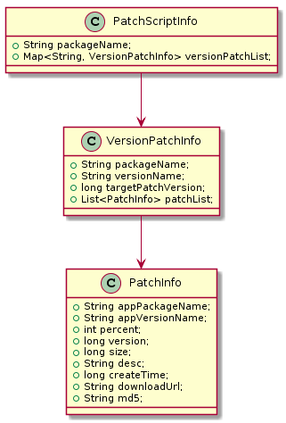
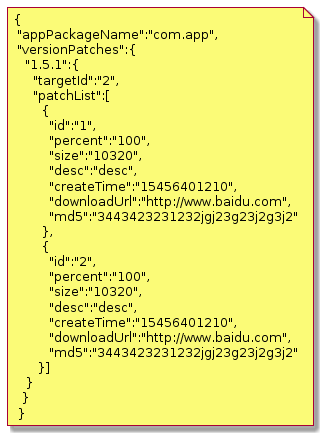
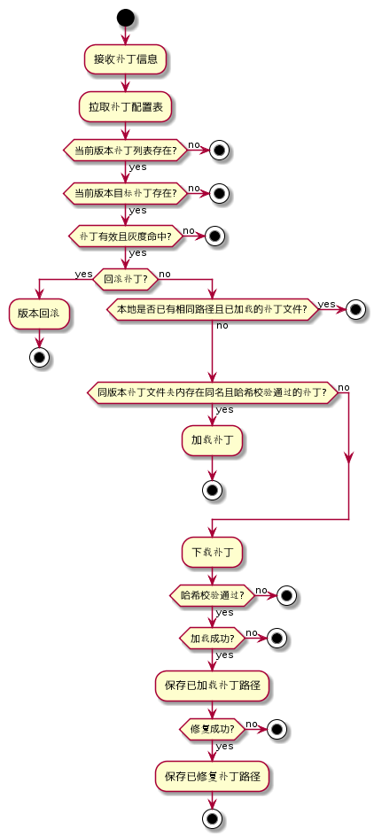

一般的git开发流程可参考 [Git Flow](https://nvie.com/posts/a-successful-git-branching-model/) 一文，核心的分支概念主要由以下五类分支：

* 主分支 master，发布线上应用及版本 tag
* 开发分支 develop，开发总分支
* 功能分支 feature，版本功能开发测试分支
* 补丁分支 hotfix，紧急 bug 修复分支
* 预发分支release，功能测试回归预发版分支

一般而言，一个版本可能需要开发多个功能，可从 develop 拉取一个该版本的总 feature 分支，然后该总 feature 分支再拉取各个子分支给团队内部人员开发。这样子可尽可能隔离与 develop 交互，尽可能避免或减少分支的合并冲突。
下面以我们团队日常开发分支实践展开，同时区分常规发版及补丁发版来修复紧急 Bug 来梳理整个版本的开发流程，见下图。


#### 补丁与应用的关系

* 一个应用存在多个版本
* 一个应用版本可存在多个补丁，同个版本的补丁，高版本补丁可覆盖低版本补丁。

定义补丁信息，版本补丁信息，应用补丁信息

```
public class PatchInfo {
    public String appPackageName;
    public String appVersionName;
    public int percent = Constants.VERSION_INVALID;                //灰度或者全量，在(0-10000]之间
    public long version = Constants.VERSION_INVALID;                //补丁版本，有效的版本应该是(1-正无穷)，0为回滚，如果找到patchData下的补丁version匹配，则修复，否则跳过
    public long size;                                               //补丁包大小
    public String desc;                                             //补丁描述
    public long createTime;                                         //补丁创建时间
    public String downloadUrl;                                      //补丁下载链接
    public String md5;			                                    //补丁文件md5												
  }   
  
public class VersionPatchInfo {
    public String packageName;
    public String versionName;
    public long targetPatchVersion;
    public List<PatchInfo> patchList;
}              

public class PatchScriptInfo {
    public String packageName;                              //修复app的包名
    public Map<String, VersionPatchInfo> versionPatchList;  //当前app下所有修复列表，按版本区分
}                             
```
则三者的关系为



#### 补丁接收与存储

客户端可定义配置表，用于声明全平台所有版本的补丁信息。



这份信息表存放在服务器上，通过暴露资源链接 URL 给客户端，由客户端读取配置表并执行对应逻辑。服务端暴露的手段有两种：

* 主动推送，客户端接收推送后获取 URL 请求配置表；
* 配置下发，客户端启动拉取配置读取是否有配置表 URL，若有则请求配置表。

有了上述的补丁与应用的关系，我们还需要定义一个内部存目录用于存放客户端拉取的所有补丁 

```
/data/data/{appPackageName}/patch/
```
补丁根据应用版本进一步分目录存储

```
/data/data/{appPackageName}/patch/{appVersionName}/
```
最终特定版本的特定补丁路径为

```
/data/data/{appPackageName}/patch/{appVersionName}/{patchInfo.version}_{patchInfo.md5}.apk
```

#### 补丁加载逻辑
当应用获取到一份热修配置表到真正加载补丁，要完成以下流程。




  
